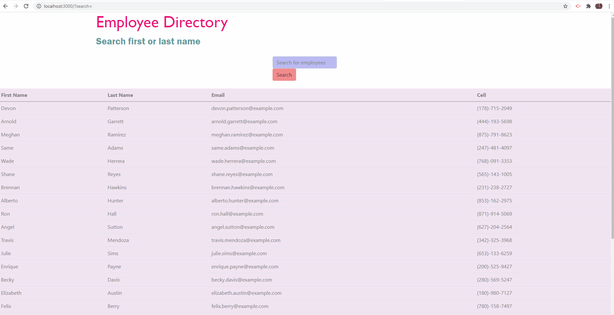

# Employee Directory


## Link to the website

https://diego773.github.io/employee-directory/

## Table of Contents

- [Description](#description)
- [Demo](#demo)
- [Technology Used](#technology-used)
- [Built With](#built-with)
- [License](#license)
- [Questions](#questions)

## Description:

Employee Directory allows employees or managers access employees information like name,email, and phone number. The employee list was populated by an API GET Request to https://randomuser.me.

# Demos



This client-side application allows a user to quickly search for an employee's contact information, and will dynamically filter out employees as the user inputs keystrokes. The employee list was populated by an API GET Request to https://randomuser.me. This application was created with React and Bootstrap, and was based on a project prompt I received from the University of Minnesota's Full Stack Web Development Bootcamp. I deployed this application's build folder to github using the "gh-pages" NPM package.

## Installation

Feel free to clone or fork this repo if you find it useful.
To install dependencies make sure to run:

```
npm i
```

## Technology Used

- HTML 5
- CSS 3
- JavaScript
- Axios - Used to make an API call to https://randomuser.me/ to obtain example employees
- Bootstrap - Used to structure the design of the site
- React
- JSX
- "gh-pages" NPM package - Used to deploy a React Application to github pages.

## Build With

- VS Code - https://code.visualstudio.com/

## License:

[](https://opensource.org/licenses/MIT)

For more information about the license, click the link below:

- [License](https://opensource.org/licenses/)
